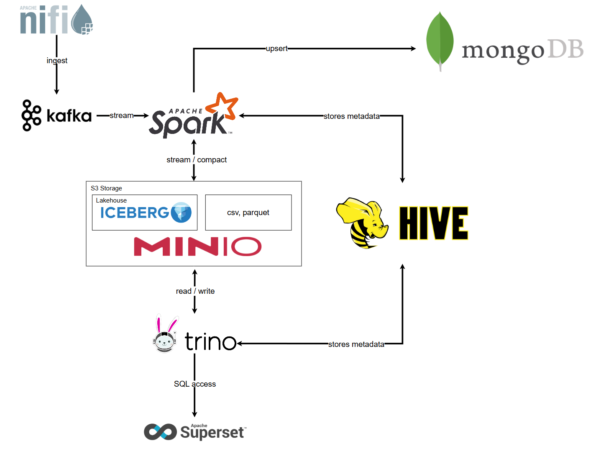

# Project: Live Weather Data Aggregation System

## 1. Project Overview

This is a project for the "Big Data Storage and Processing" course, with the objective of building a complete big data processing system to solve a real-world problem. The project focuses on creating an end-to-end data pipeline to ingest, process, store, and visualize real-time weather data.

The system is capable of:
-   Continuously ingesting data from multiple sources (APIs, sensors).
-   Processing and enriching data via streaming.
-   Providing a powerful SQL query interface and visualization tools for data exploration.

## 2. Technology Stack

-   **Data Ingestion:** Apache NiFi, Apache Kafka
-   **Data Processing:** Apache Spark
-   **Storage:** MinIO (S3), Apache Iceberg, MongoDB (or Cassandra)
-   **Metadata/Catalog:** Hive Metastore
-   **Query Engine:** Trino
-   **Authorization:** Open Policy Agent (OPA)
-   **Visualization:** Apache Superset

## 3. General architecture
This project is implemented using the **Kappa Architecture**. This model offers a simpler and more efficient approach than the Lambda architecture by utilizing a single stream processing pipeline to handle all data.

### Key Components

1.  **Data Ingestion: Apache NiFi & Apache Kafka**
    -   `Apache NiFi`: Ingests data from external sources (weather APIs, sensors, etc.). NiFi's graphical interface allows for the flexible construction of drag-and-drop data flows.
    -   `Apache Kafka`: Acts as the system's backbone, receiving data from NiFi and forming a durable, fault-tolerant message bus. Kafka decouples the data producers (NiFi) from the data consumers (Spark).

2.  **Data Processing: Apache Spark**
    -   The brain of the system, using `Spark Structured Streaming` to read and process data from Kafka in real time.
    -   Spark performs tasks such as cleaning, transformation, and aggregation, then pushes the results to two different destinations for their respective use cases.

3.  **Storage and Analytics (Analytics Path - OLAP)**
    -   `MinIO (S3 Storage)`: A distributed object storage system that serves as the Data Lake, holding the physical data at a low cost with high scalability.
    -   `Apache Iceberg`: An open table format built on top of MinIO. It brings critical features like ACID compliance, performance, and manageability of a traditional Data Warehouse to the Data Lake.
    -   `Hive Metastore`: Acts as the central catalog, storing all metadata (schemas, partitions, etc.) for the Iceberg tables, enabling consistent data access for both Spark and Trino.

4.  **Application Serving (Serving Path - OLTP)**
    -   `NoSQL Database (MongoDB/Cassandra)`: Processed data (e.g., the latest weather status for each city) is written to a NoSQL database. This system is optimized for fast, low-latency lookups, serving data directly to applications (web, mobile).

5.  **Querying & Visualization**
    -   `Trino`: A distributed SQL query engine that allows end-users (like Data Analysts) to execute complex analytical SQL queries directly on the Iceberg tables.
    -   `Open Policy Agent (OPA)`: Integrates with Trino to enforce fine-grained data access policies, ensuring security.
    -   `Apache Superset`: A BI tool that connects to Trino, enabling users to build dashboards and dynamic charts to explore and visualize the analytical data.